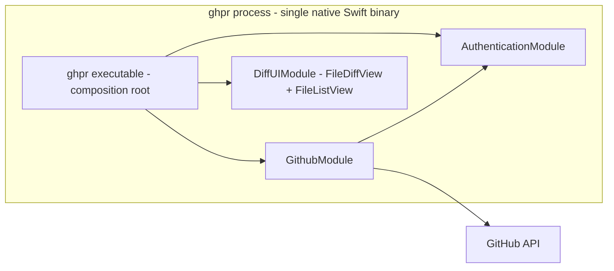

# ghpr — Fully Native Swift/SwiftUI GitHub PR Reviewer

A standalone macOS CLI tool that opens a full-featured GitHub PR review window directly from the CLI process. Pure native Swift/SwiftUI — no `.app` bundle, no web technologies, no Electron/webviews, no TypeScript.

This document is the implementation plan and the source of truth for scope and architecture decisions. It is written so a fresh agent can pick up any milestone without prior context.

## Decision log (why things are the way they are)

- **Standalone window, not an editor plugin.** Originally explored as a Zed extension; Zed extensions cannot render custom UI, so this is a standalone tool. All editor integration ideas were dropped deliberately — do not reintroduce them.
- **Fully native rendering, no web stack.** pierre-diffs (web diff library) was considered and rejected to avoid TS/web dependencies. Its hardest problem — virtualizing huge diffs in the DOM — is a non-problem natively (lazy SwiftUI rows / NSTableView). We rebuild only the parts we need: patch parsing, syntax highlighting, intra-line diffs, annotation slots.
- **No `gh` CLI dependency.** The tool talks to the GitHub API directly (URLSession). `gh` is at most an optional, silent token source.
- **Zero git writes.** ghpr never checks out, fetches, or mutates a repository. Only read-only git queries (origin URL, current branch). Reviewing is fully remote via the API (patch, file contents at SHAs, threads, checks).
- **Diff computation is not our job.** The GitHub API serves the unified patch (`Accept: application/vnd.github.diff`); we parse and render it.

## CLI surface (v1)

- `ghpr <pr-url>` — open a review window for that PR, fully remote (no clone needed).
- `ghpr` — current-directory mode: (1) identify repo from `origin` remote, (2) read current branch, (3) look up the open PR for `owner:branch`, (4) open it — or exit non-zero with a clear error suggesting `ghpr dash`. Not a git repo / no origin / detached HEAD → specific error messages.
- `ghpr dash` — dashboard window: open PRs for the cwd repo (filters: review-requested / mine / all); selecting one opens a review window in the same process.
- `ghpr auth token|status|logout` — auth management.
- Lifecycle: windows close → process exits → terminal returns. `--detach` (polish) re-execs into the background.

Review window contents: PR description (markdown via `AttributedString`), CI checks, reviewers/labels, changed-files list + per-file diff with inline comment threads, pending-review batch, approve / request changes / comment.

## Module structure

One `Package.swift`, **one CLI product**, many targets. Built incrementally in this order:

1. **`ghpr`** (executable product target) — starts empty (swift-argument-parser + help), grows into the composition root: NSApplication bootstrap, windows, review/dashboard screens, and the mapping between module models. Review-specific UI (thread views, verdict bar, pending-batch UI) lives here initially; split into its own module only when it grows.
2. **`AuthenticationModule`** — token resolution chain, in priority order:
   1. `GHPR_TOKEN` / `GITHUB_TOKEN` env var
   2. macOS Keychain (Security framework), populated via `ghpr auth token` (PAT paste; fine-grained PR read/write + contents read, or classic `repo` scope)
   3. optional silent borrow of `gh auth token` if gh happens to be installed (convenience, never a dependency)
   4. nothing found → friendly first-run guidance.
   Stretch goal (polish, not v1): OAuth device flow (`ghpr auth login`).
3. **`GithubModule`** — depends on `AuthenticationModule`.
   - `GitHubClient` over URLSession, async/await, Codable models.
   - REST: PR list/detail, unified patch (`Accept: application/vnd.github.diff`), file contents at base/head SHAs, check-runs, create review (`comments[]` + event `APPROVE`/`REQUEST_CHANGES`/`COMMENT`), single comments, replies.
   - GraphQL: `reviewThreads` (thread + resolution state — REST lacks it), `resolveReviewThread` mutation.
   - `Link`-header pagination helper.
   - Local repo context (read-only git): origin URL → owner/repo (SSH and HTTPS forms), current branch; branch→PR resolution via `GET /repos/{o}/{r}/pulls?head={owner}:{branch}&state=open`.
   - Fixture-tested against captured JSON/diff from a real PR.
4. **`DiffUIModule`** — **generic and GitHub-unaware**. Defines its own input format (file diff model: hunks, lines, change kinds, language hint) plus a unified-diff parser producing that format. Exposes two independent SwiftUI components that must not know about each other (the parent composes them):
   - `FileDiffView` — given one file's diff model: line-number gutter, add/delete tinting, Myers intra-line word diffs (`CollectionDifference` over tokenized changed-line pairs), background tree-sitter syntax highlighting with per-file caching (SwiftTreeSitter + Neon; grammars as SwiftPM deps: Swift, ObjC, C/C++, Kotlin, JS/TS, JSON, YAML, Markdown, Python, Bash, Rust, Go; plain-text fallback), per-file collapse, expand-context hooks, and **per-line annotation slots** (view-builder injection) so callers can attach arbitrary inline views (e.g. review threads) without the module knowing what they are.
   - `FileListView` — given a list model (paths, statuses, +/- counts): renders the changed-files list with a selection callback.

## Key implementation notes

- **CLI-opens-window mechanics**: parse args first; UI commands then create `NSApplication.shared`, set `.regular` activation policy, build a minimal main menu programmatically (cmd-Q, cmd-W, copy/paste so text fields behave), open `NSWindow` with `NSHostingView`, `activate(ignoringOtherApps:)`, `app.run()`. Escape hatch if un-bundled AppKit misbehaves: materialize a hidden minimal `.app` wrapper under `~/Library/Application Support/ghpr/` and exec it — UX stays pure-CLI either way.
- **Performance spike is built into milestone 4**: the DiffUIModule fixture-demo window doubles as the spike — render a large real patch with background highlighting and decide SwiftUI lazy rows vs an `NSTableView` wrapper *before* features stack on the renderer.
- **Reviews**: comments collect into a local pending batch, submitted as one review; single-shot comments also supported.
- **GHES**: later, via `GHPR_GITHUB_API` env override (low priority).

## Milestones

Each milestone should build, pass its tests, and be usable before moving on.

1. **Scaffold** — `Package.swift` with the single `ghpr` executable product target; builds and prints help via swift-argument-parser.
2. **AuthenticationModule** — token chain implemented + unit tests; `ghpr auth token|status|logout` wired and working against Keychain.
3. **GithubModule** — client + models + repo/branch detection + branch→PR resolution; fixture tests from a captured real PR (JSON + `.diff`).
4. **DiffUIModule** — parser + `FileDiffView` + `FileListView`; hidden `ghpr demo` command renders a bundled large patch fixture in a window (this is the AppKit-from-CLI + performance spike; decide row host here).
5. **Review window (read path e2e)** — `ghpr <url>` and bare `ghpr` open a real PR: description, checks, file list + diffs, existing threads rendered via annotation slots.
6. **Write path** — new line comments, replies, resolve, pending batch, approve / request changes / comment, refresh after submit.
7. **`ghpr dash`** — PR list with filters, opens review windows in-process.
8. **Polish** — `--detach`, split-view toggle, keyboard nav (j/k between files, cmd-enter submit), light/dark appearance sync, auth/rate-limit error surfaces, `make install` (binary to /usr/local/bin), README. Stretch: OAuth device flow.

## Accepted constraints

- macOS-only by design; personal-tool distribution (plain binary, no signing/notarization ceremony). `swift build -c release` produces the entire artifact — no asset pipeline.
- While a window is open the process shows a generic Dock presence (executable name, no custom icon); the hidden-wrapper escape hatch would fix this if it ever matters.
- v1 ships unified diff layout; split view lands in polish. Highlighting is per-hunk best-effort in v1 (full-file-parse highlighting via the expand-context file fetch is a documented follow-up).
- Markdown rendering uses `AttributedString(markdown:)` — basic formatting; images in comments render as links in v1.
- GitHub.com first; Enterprise via env override later. Rate-limit handling is basic (surface the error; no retry queue).
- One-time auth setup required (paste a PAT via `ghpr auth token`) unless a token env var or gh is already present.

## Environment facts (verified on this machine)

- macOS, Swift toolchain via Xcode, `cargo`/`node` present but irrelevant now; **no bun**. `git` and `gh` installed (`gh` may serve as a token source only).
- Target platform in `Package.swift`: macOS 14+ (SwiftUI APIs used should respect this).
